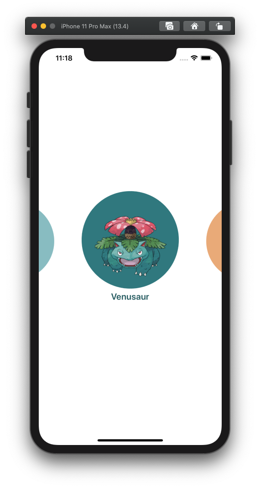
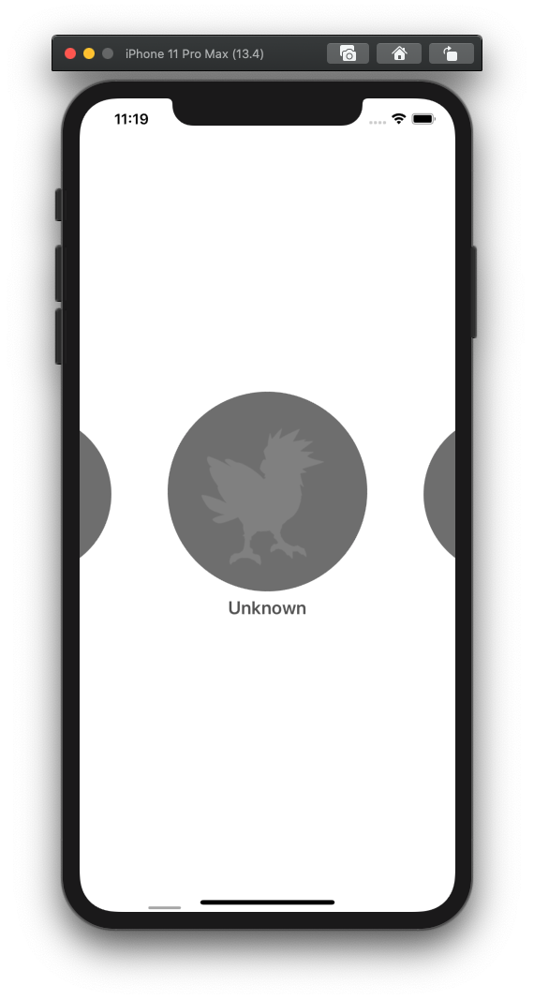
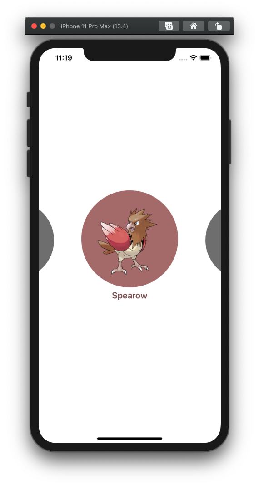
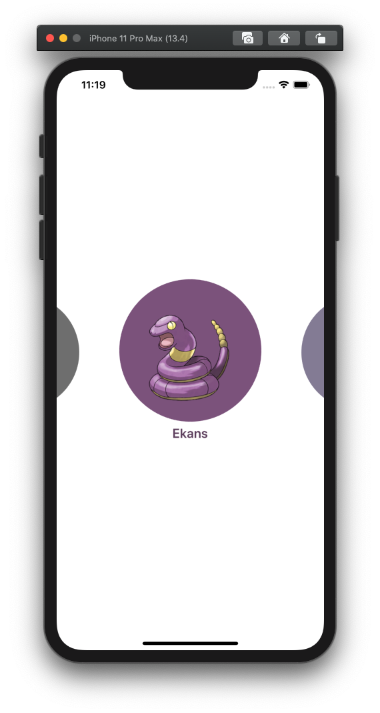

# Pokémon Cover Flow

### Opis dzialania aplikacji

 Aplikacja składa się z jednego ekranu, który cały zawiera `UICollectionView`. W Collection View znajduje się 151 elementów (Pokémonów) pobranych z serwera DaftMobile (hostowany na Google Cloud). Nie korzystamy z żadnych *Supplementary View*, ani *Decoration View* (w tym zadaniu).

### Wymagania

1. Komórki Collection View są ułożone po kolei i przewijają się poziomo.
2. Komórka najbardziej na środku ma wyświetlony obrazek z Pokémonem (alfa obrazka wynosi 1) (pojawia się płynnie w miarę przewijania)
3. Komórka najbardziej na środku jest powiększona (a właściwie to wszystkie inne są pomniejszone)
4. Scrollowania nie da się zatrzymać "pomiędzy" komórkami – zawsze jest jakaś komórka która jest wyśrodkowana
5. Tapnięcie w komórkę powoduje złapanie Pokémona (catch) oraz odświeżenie komórki po złapaniu
