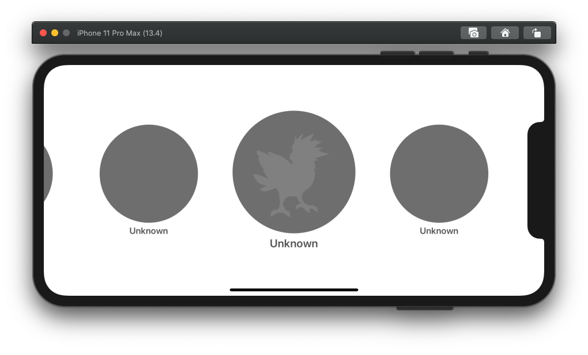

### Assignment #4

# Pokémon Cover Flow

### Opis zadania

Celem zadania jest stworzenie aplikacji **Pokemon Cover Collection**. Aplikacja składa się z jednego ekranu, który cały zawiera `UICollectionView`. W Collection View znajduje się 151 elementów (Pokémonów) pobranych z serwera DaftMobile (hostowany na Google Cloud). Nie korzystamy z żadnych *Supplementary View*, ani *Decoration View* (w tym zadaniu).

Zachowanie aplikacji zaprezentowane jest też na załączonym [filmie](http://recruitment.app.daftmobile.com/assignment_4_video.mp4).

### Wymagania

1. Komórki Collection View są ułożone po kolei i przewijają się poziomo.
2. Na komórce widać nazwę Pokémona, oraz jego obrazek
3. Komórki są zgodne z designem (ze screenshotów)
4. Komórka najbardziej na środku ma wyświetlony obrazek z Pokémonem (alfa obrazka wynosi 1) (pojawia się płynnie w miarę przewijania)
5. Komórka najbardziej na środku jest powiększona (a właściwie to wszystkie inne są pomniejszone)
6. Scrollowania nie da się zatrzymać "pomiędzy" komórkami – zawsze jest jakaś komórka która jest wyśrodkowana
7. Aplikacja obsługuje zmianę orientacji (✌️🌈) – po rotacji wciąż mamy zaznaczonego **tego samego** Pokémona
8. Tapnięcie w komórkę powoduje złapanie Pokémona (catch) oraz odświeżenie komórki po złapaniu

### Wskazówki

- ad 1. Za każdym razem gdy używasz Collection View – krok pierwszy to **zastanów się, czy możesz do tego użyć `UICollectionViewFlowLayout`**.
- ad 2. Zastanów się jakie atrubyty musisz przekazać komórkom z layoutu.
- ad 4. Użyj do tego metody delegate `UIScrollView` (*scrollViewWillEndDragging:withVelocity:targetContentOffset:*)
- ad 5. `invalidateLayout()`, oraz trzeba policzyć nowy `contentOffset` po rotacji.
- Dziedzicząc po `UICollectionViewFlowLayout` musisz przeciążyć dwie metody: `layoutAttributesForElementsInRect` oraz `layoutAttributesForItemAtIndexPath`
- Pamiętaj, że w przypadku naszego `CoverLayout` parametry layoutu zmieniają się w każdej klatce scrollowania (metoda `shouldInvalidateLayoutForBoundsChange`).
- Dodając nowe właściwości (dziedzicząc po `UICollectionViewLayoutAttributes`) pamiętaj żeby **poprawnie** przeciążyć `copy()` oraz `isEqual`.
- Pamiętaj żeby w swojej `UICollectionViewCell` przeciążyć metodę `applyLayoutAttributes`.
- Pobieranie listy Pokémonów oraz obrazków nie jest częścią zadania. Przydatne klasy, które możesz do tego wykorzystać znajdziesz już w projekcie.

### Odpowiedzi

Odpowiedzi będą automatycznie przyjmowane do końca soboty **02.05.2020, 23:59**. Pamiętaj o pushowaniu swoich commitów!

#### Powodzenia!
